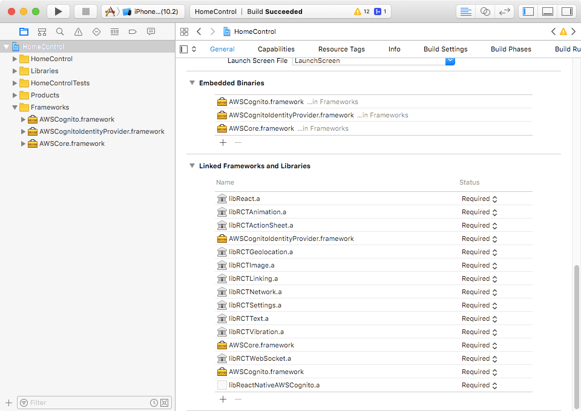

# React Native AWS Cognito module

## Adding to project:

1. Install via npm or yarn:

```
npm install react-native-aws-cognito
yarn add react-native-aws-cognito
```

2. Link this project:

```
react-native link react-native-aws-cognito
```

3. Add the following frameworks from AWS SDK to your project "Frameworks" directory:
    - AWSCognitoIdentityProvider
    - AWSCognito
    - AWSCore

And make sure all libraries are properly linked. Like on the screenshot below:



(Tested with AWS iOS SDK 2.5.1)

## TODO:

- [x] implement user authentication using Cognito provider
- [x] allow retrieving temporary credentials
- [ ] implement API for registration (work in progress)
- [ ] implement API for password recovery
- [ ] implement API for storing user data

React Native module for authentication with AWS Cognito.

Motivation to work on this module (and so, best use case) was having a secure, simple and cheap user management system that can access AWS IoT devices.

It supports Enhanced (Simplified) Authflow as described on http://docs.aws.amazon.com/cognito/latest/developerguide/authentication-flow.html

There are some limitations in this module:
- only iOS is supported
- it supports only AWS Cognito login provider

Pull requests welcome!


Sample code for retrieving signed url and using it to connect with AWS IoT using MQTT over Websocket:

```
import { getSignedUrl } from 'aws-signing-utils';
import AWSCognito from 'react-native-aws-cognito';
import AWSConfig from './my-aws-config.json';

AWSCognito.setUserPool(
  AWSConfig.region,
  AWSConfig.identityPoolId, // Federated identity pool id
  AWSConfig.clientId, // App client ID
  AWSConfig.secret, // App client secret - leave this undefined if your app doens't use secret
  AWSConfig.userPoolId // user pool ID
);

// Email and password that you get from the user during the log in process
AWSCognito.getSession(user.email, user.password)
  .then( () => AWSCognito.getCredentials(AWSConfig.email) )
  .then( (credentials) => {
    console.log('Temporary credentials:');
    console.log('accessKey', credentials.accessKey);
    console.log('secretKey', credentials.secretKey);
    console.log('sessionKey', credentials.sessionKey);

    const endpointUrl = getSignedUrl({
      method: 'GET',
      protocol: 'wss',
      canonicalUri: '/mqtt',
      service: 'iotdevicegateway',
      region: AWSConfig.region,
      secretKey: credentials.secretKey,
      accessKey: credentials.accessKey,
      sessionKey: credentials.sessionKey,
      host: AWSConfig.endpointAddress,
    });

    console.log("Signed AWS IoT url: ", endpointUrl)
  } )
  .catch( err => console.error('Error: ', err) )
``